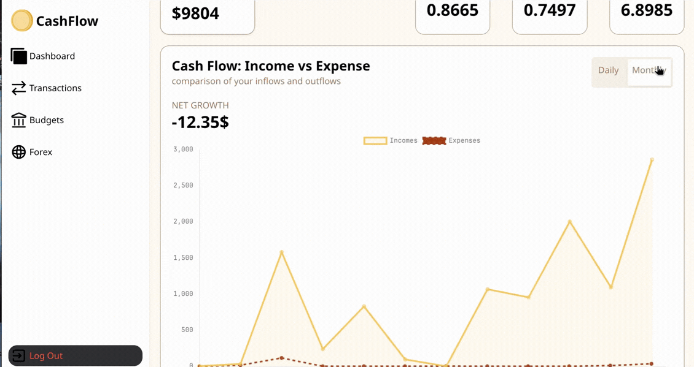

# Welcome to Cash Flow

A modern tool to keep track of finances and not be left behind

[visit it here](https://cash-flow-pied.vercel.app/)

## Features

- keep track of your incomes and expenses with modern graphs
- add transactions and expenses
- make budgets and save money
- keep tracks of forex

## Getting Started

### Installation

clone the repo

```bash
git clone https://github.com/DanielJaffritz/CashFlow.git
```

Install the dependencies:

```bash
npm install
```

### Development

Start the development server with HMR:

```bash
npm run dev
```

> make sure to get your forex api key based on the .env.example

Your application will be available at `http://localhost:5173`.

## Building for Production

Create a production build:

```bash
npm run build
```

## Deployment

### Docker Deployment

To build and run using Docker:

```bash
docker build -t my-app .

# Run the container
docker run -p 3000:3000 my-app
```

The containerized application can be deployed to any platform that supports Docker, including:

- AWS ECS
- Google Cloud Run
- Azure Container Apps
- Digital Ocean App Platform
- Fly.io
- Railway

### DIY Deployment

If you're familiar with deploying Node applications, the built-in app server is production-ready.

Make sure to deploy the output of `npm run build`

```
├── package.json
├── package-lock.json (or pnpm-lock.yaml, or bun.lockb)
├── build/
│   ├── client/    # Static assets
│   └── server/    # Server-side code
```

## Stack used

- Reactjs
- React router
- TailwindCSS
- Firestore and Auth0


